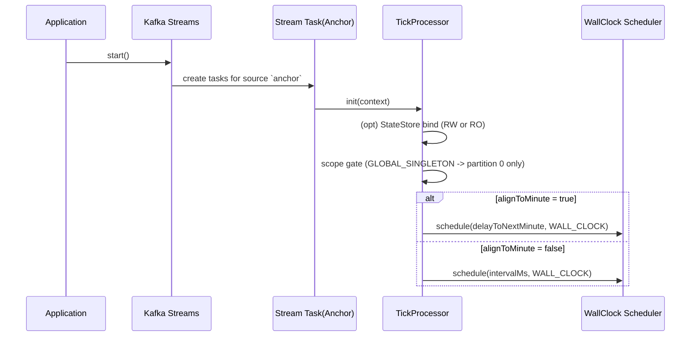
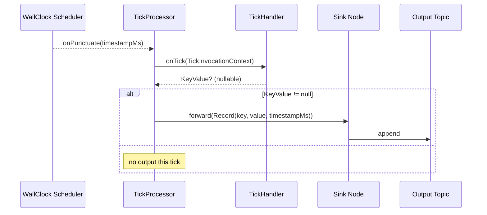
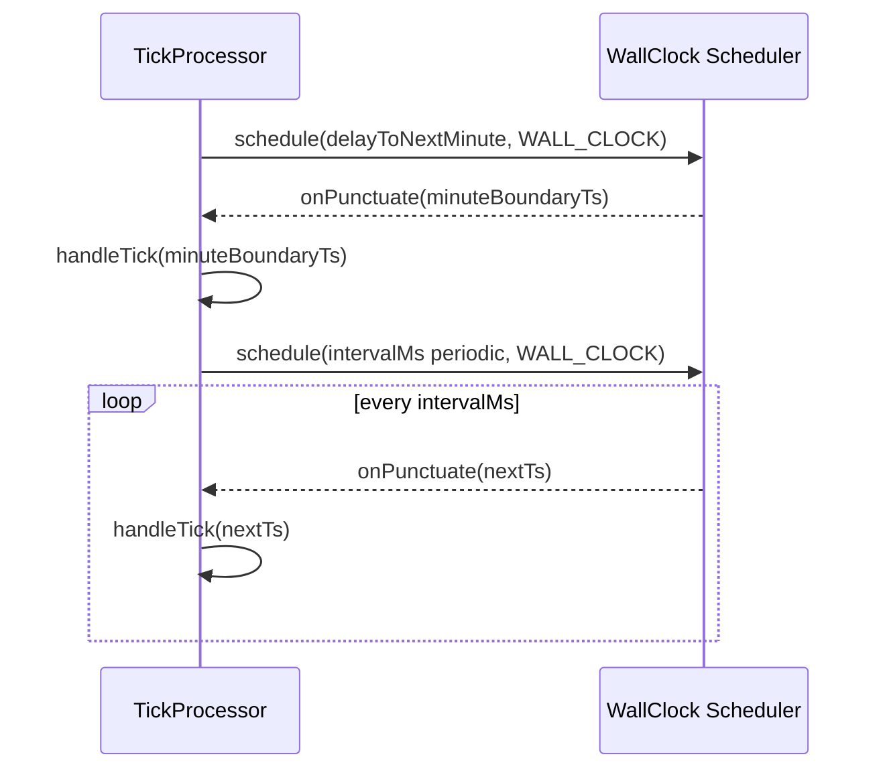

## Time-Triggered KStreams - Sequence Diagrams

### Startup and Schedule Registration (Processor API)

```mermaid
sequenceDiagram
    participant App as Application
    participant KS as Kafka Streams
    participant Task as Stream Task(Anchor)
    participant TP as TickProcessor
    participant WC as WallClock Scheduler

    App->>KS: start()
    KS->>Task: create tasks for source `anchor`
    Task->>TP: init(context)
    TP->>TP: (opt) StateStore bind (RW or RO)
    TP->>TP: scope gate (GLOBAL_SINGLETON -> partition 0 only)
    alt alignToMinute = true
        TP->>WC: schedule(delayToNextMinute, WALL_CLOCK)
    else alignToMinute = false
        TP->>WC: schedule(intervalMs, WALL_CLOCK)
    end
```

### Periodic Tick Emission

```mermaid
sequenceDiagram
    participant WC as WallClock Scheduler
    participant TP as TickProcessor
    participant TH as TickHandler
    participant Sink as Sink Node
    participant Topic as Output Topic

    WC-->>TP: onPunctuate(timestampMs)
    TP->>TH: onTick(TickInvocationContext)
    TH-->>TP: KeyValue? (nullable)
    alt KeyValue != null
        TP->>Sink: forward(Record(key, value, timestampMs))
        Sink->>Topic: append
    else
        Note over TP: no output this tick
    end
```

### Minute Alignment (alignToMinute = true)

```mermaid
sequenceDiagram
    participant TP as TickProcessor
    participant WC as WallClock Scheduler

    TP->>WC: schedule(delayToNextMinute, WALL_CLOCK)
    WC-->>TP: onPunctuate(minuteBoundaryTs)
    TP->>TP: handleTick(minuteBoundaryTs)
    TP->>WC: schedule(intervalMs periodic, WALL_CLOCK)
    loop every intervalMs
        WC-->>TP: onPunctuate(nextTs)
        TP->>TP: handleTick(nextTs)
    end
```

